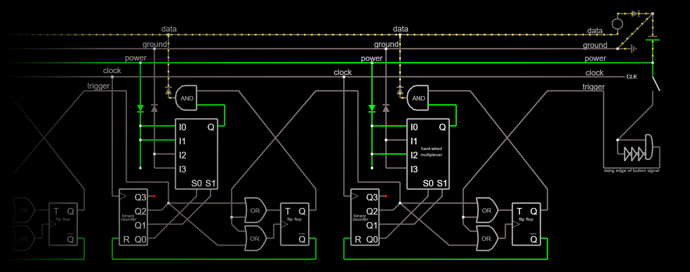

# Talk Blocks

What if you had blocks with words on them that you could fit together to make sentences, and then press a button to read the sentence out loud?

You'd have a cool toy, that's what.

Don't forget to punctuate your sentences!
The block at the end is the brain,
and the dot is the button you press to speak the sentence.

The blocks will be commercially available in sets,
but further customization will be highly encouraged.

With a base as simple as a block, [artistic possibilities are endless](BLOCK-IDEAS.md) for custom blocks.
Blocks can be painted or made from various materials.
Typography can be tweaked and tinkered with.
Electrical components such as LEDs can be powered with the existing power channel.
Many blocks can be made self-descriptive.

We may offer some kind of custom block kit(s),
however the technology will be open source,
so you will always be able to buy the needed parts yourself if you want.

## How will it work?

Blocks will connect end to end with magnets hidden just inside the wood,
with metal contacts to complete the circuit between blocks.

When you press the button,
the brain block sends a signal to the adjacent connected word block.
The triggered block sends back a word ID to the brain
before triggering the next block.
The brain block receives the words in reverse order,
and waits until it stops receiving words to speak.

### The Circuit

To run this simulation, open [circuit.txt](./circuit.txt) (Raw, select all, copy) in [circuitjs][] (File > Import from Text, paste, OK).
Use <kbd>Alt</kbd>+Drag to pan around.
You can click on the button represented by a slanted white line to trigger the start of the sequence.

The circle in the upper right of the diagram is where the data is read from.
The whole right side area represents the brain block.
It will use a [Raspberry Pi][] at least for the prototype.

In the current design, there is support for only a fixed number of possible words.
If it were built as it is in the above diagram, it would support only 2⁴ = 16 words, but we would not use a multiplexer with so few inputs.
With an 8 bit multiplexer we could get 256 words,
but it's still worth looking into making IDs [be able to be] dynamically sized numbers for forwards compatibility.
After all, the 2³² space of IPv4 addresses more or less [ran out][IPv4 exhaustion].
Maybe it should just send the words encoded in UTF-8.
That would mean the minimum complexity of the blocks would be higher, but it would be conceptually simpler; you wouldn't have to register a block ID with a database for it to be recognized, and brain blocks wouldn't need to maintain an up-to-date version of that database.
At any rate, the prototype will likely use word IDs.

Also, it would be good to leave one or two channels for future use.
(I can think of a few interesting uses.)

### The Code

Located in [`src/`](src/) is the code for the brain along with some tests.
It uses a fixed "database" of words, implemented [in the simplest way possible][], as an array, and it simulates the data transfer bit by bit.

### Notes

* Pressing the button a second time can stop speech playback. After all, it is a [full stop][] button.

* If there is a failing connection, you can pinpoint its location by what word the speech starts on.

* The brain block can also query the chain of words without reading it aloud.
  This would be great for some kind of educational app(s).

* In the circuit simulation, the clock is not controlled and the button is directly in the circuit, making it unreliable, but as implemented in the code, the real thing will send a trigger signal syncronized with the clock.

<!--
* How can prefix/postfix blocks overlap the preceding block to counteract word spacing (and maybe sometimes overlap a letter)?
    * If we assume all blocks are the same height, it can simply fixedly stick out.
    * We could sacrifice equal left/right padding on the blocks,
      but if we want to do both postfixes and postfixes,
      I don't think that would work
    * It could flip over mechanically when connected via a button on the connecting side.
      I don't know how exactly it would appear when not flipped over onto a block.
    * Instead of flipping it could jump up and slide over.
    * It could be on an up/down slider, then it could settle on any block (as reasonably sized as any of the other ideas).
      It might be more likely to break (than if fixed),
      but it's simpler than flipping or jump-sliding.

* There can be speech synthesis easter eggs. :)

* Need to make sure the electrical connections will be and are safe

* I want to file for an [open patent][] if possible.
-->

## The Spec

The specification defines guidelines for compatibility and consistency with other blocks.

The actual specifications have not been determined yet.
What follows should give you an idea of what will be included in the guidelines, but not much else.

There will also be 3D diagrams to go along with the specs.
<!-- Can they be interactive?
Like maybe with https://help.github.com/articles/3d-file-viewer/
I guess the spec just needs to be on a web page
That's fine
-->

### Connections

Blocks should have contacts and magnets so they can connect to other blocks.

To facilitate the electronic connection, they need metal contact plates.
The bottom of the contacts should be placed at **TBD** from the bottom of the block.
For a standard size block, they should be centered horizontally and vertically.
<!-- For a non-standard block, it should probably be based on the typographical center line if there is one -->

Blocks should include a magnet at **TBD** from either end, inset by **TBD** into the bottom of the block.
They should be of **TBD** size and strength.

<!-- TODO: specify electronics related stuff in a section -->

### Dimensions

The length of blocks are completely variable,
based on the length of the word plus padding on either side.
The other dimensions of a standard block are **TBD**×**TBD**.

If a block is too large, prefix/postfix blocks may not be able to rest ontop of it, and it may not work with joiners and splitters or other special blocks.
Joiners and splitters may have some extra margins available, but it's still best to use the standard size if possible.

The edges and corners should be [filletted][fillet] (rounded) with a radius of **TBD**.

### Typography

**TBD** should be used as the default font, but other fonts and font variations can be used for various effects.
Whatever font is used, the text can still be aligned properly.

The text should be inset, in addition to being painted.

**TODO:** specify font size and margins and baselines and everything.

[in the simplest way possible]: http://c2.com/cgi/wiki?DoTheSimplestThingThatCouldPossiblyWork
[Raspberry Pi]: https://www.raspberrypi.org/
[circuitjs]: http://www.falstad.com/circuit/circuitjs.html
[IPv4 exhaustion]: https://en.wikipedia.org/wiki/IPv4#Address_space_exhaustion
[open patent]: https://en.wikipedia.org/wiki/Open_patent
[fillet]: https://en.wikipedia.org/wiki/Fillet_(mechanics)
[full stop]: https://en.wikipedia.org/wiki/Full_stop
